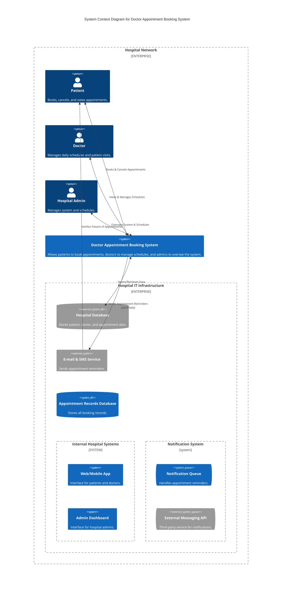
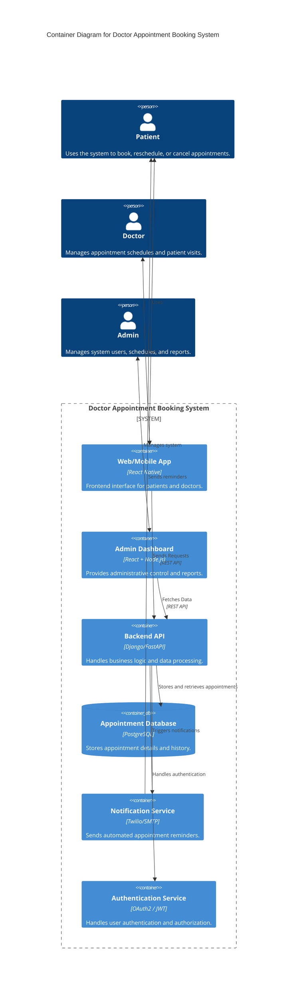
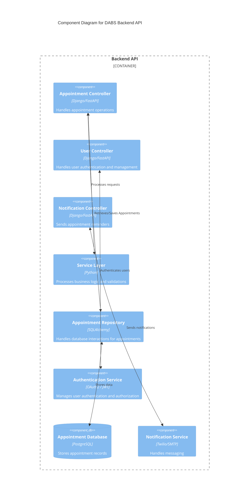
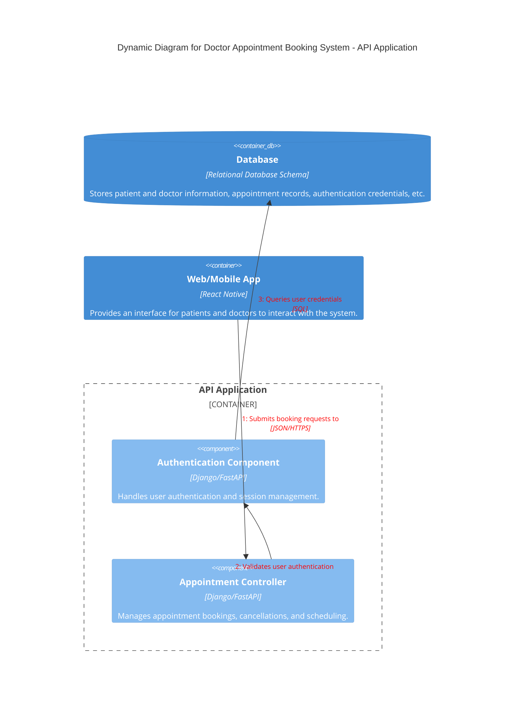

# Doctor Appointment Booking System

## Domain: Hospital

Scheduling doctor appointments manually can lead to many unpleasant situations such as long wait times, mismanagement of bookings, and difficulty in tracking different patients’ history. This will be a basic doctor appointment booking system, which will be a web and mobile-based app that will allow patients to schedule medical appointments online, manage bookings, and receive reminders. Doctors will use the system to manage their different schedules, while hospital administrators will be able to monitor appointment statistics and optimize scheduling efficiency. A notification service will be included to remind patients about upcoming appointments.

