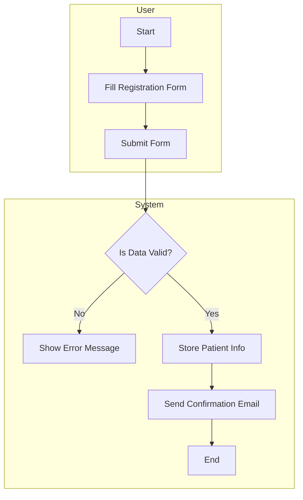
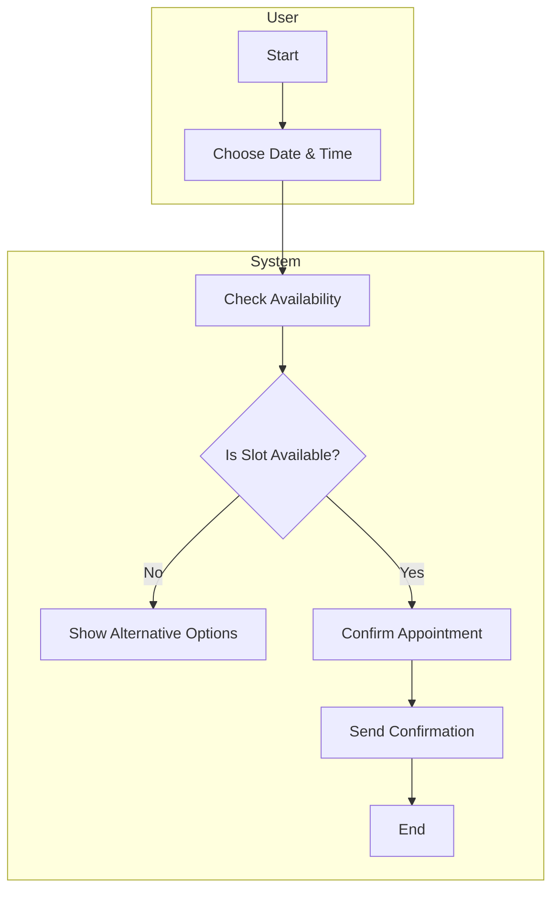
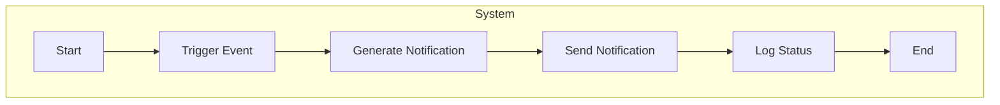
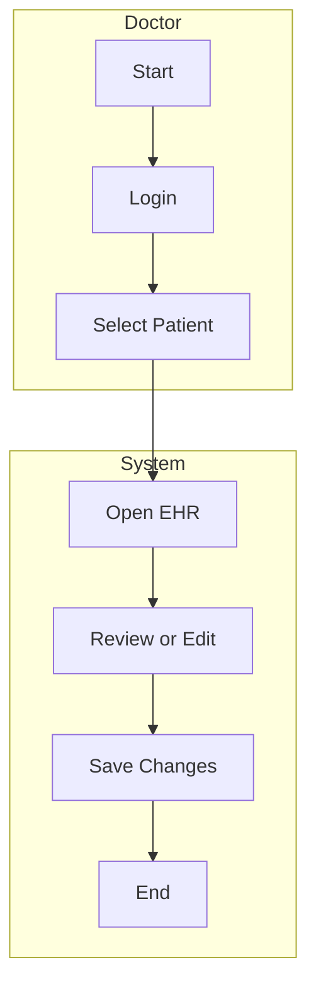
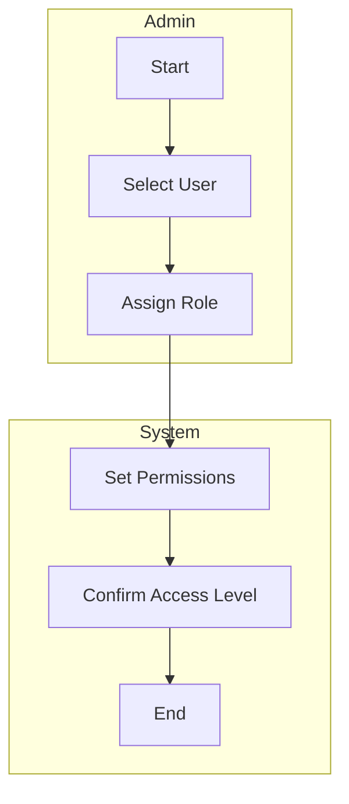
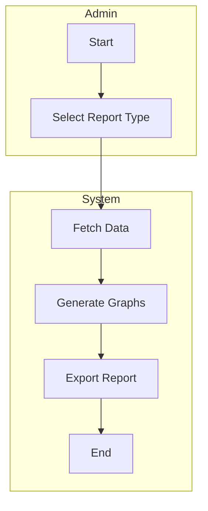
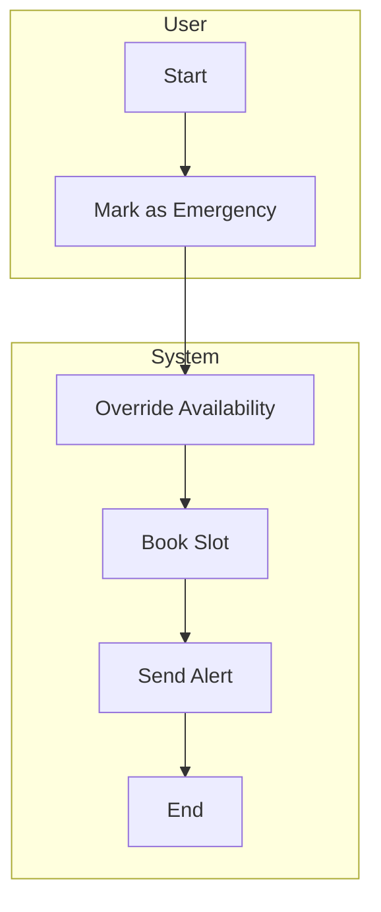

### Activity Diagrams

#### 1. Patient Registration Workflow


#### 2. Appointment Scheduling Workflow


 #### 3. User Login Workflow
 ```mermaid
 flowchart TD
    subgraph User
    A[Start] --> B[Enter Credentials]
    end
    subgraph System
    B --> C[Validate Credentials]
    C --> D{Are credentials correct?}
    D -- No --> E[Show Error]
    D -- Yes --> F[Login Success]
    F --> G[Redirect to Dashboard]
    G --> H[End]
    end
```

#### 4. Notification Dispatch


#### 5. EHR Review


#### 6. Role Management


#### 7. Report Generation


#### 8. Emergency Booking

