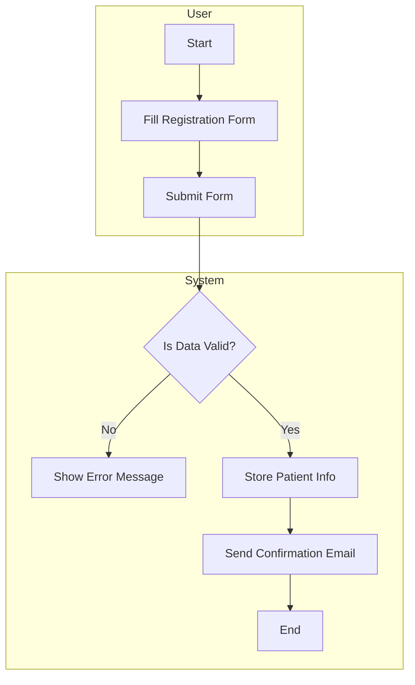

### Activity Diagrams

#### 1. Patient Registration Workflow

```mermaid
flowchart TD
    subgraph User
    A[Start] --> B[Fill Registration Form]
    B --> C[Submit Form]
    end
    subgraph System
    C --> D{Is Data Valid?}
    D -- No --> E[Show Error Message]
    D -- Yes --> F[Store Patient Info]
    F --> G[Send Confirmation Email]
    G --> H[End]
    end
```
