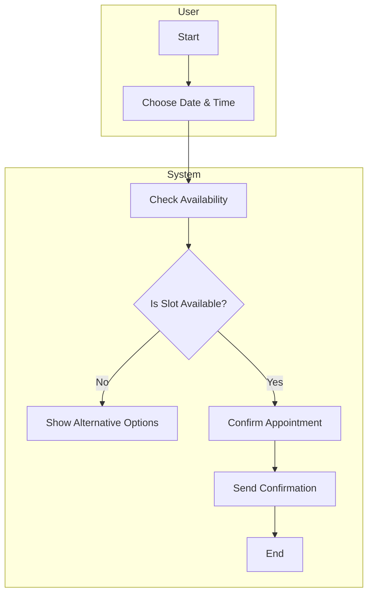

#### 2. Appointment Scheduling Workflow

```mermaid
flowchart TD
    subgraph User
    A[Start] --> B[Choose Date & Time]
    end
    subgraph System
    B --> C[Check Availability]
    C --> D{Is Slot Available?}
    D -- No --> E[Show Alternative Options]
    D -- Yes --> F[Confirm Appointment]
    F --> G[Send Confirmation]
    G --> H[End]
    end
```
