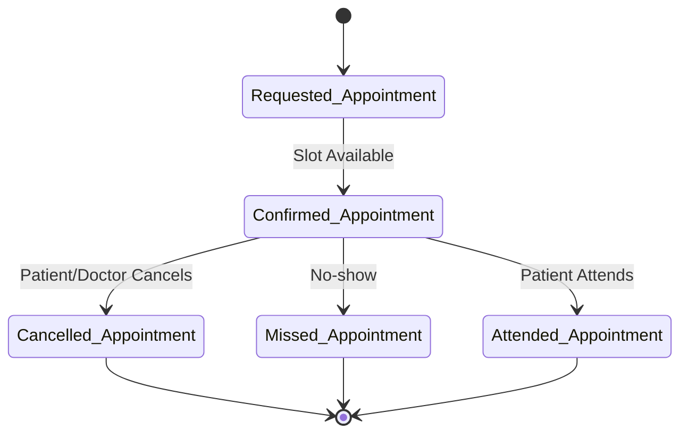

#### 3. Appointment - State Transition Diagram

```mermaid
stateDiagram
    %% Initial state
    [*] --> Requested_Appointment
    Requested_Appointment --> Confirmed_Appointment : Slot Available
    Confirmed_Appointment --> Attended_Appointment : Patient Attends
    Confirmed_Appointment --> Missed_Appointment : No-show
    Confirmed_Appointment --> Cancelled_Appointment : Patient/Doctor Cancels
    Cancelled_Appointment --> [*]
    Missed_Appointment --> [*]
    Attended_Appointment --> [*]
```
