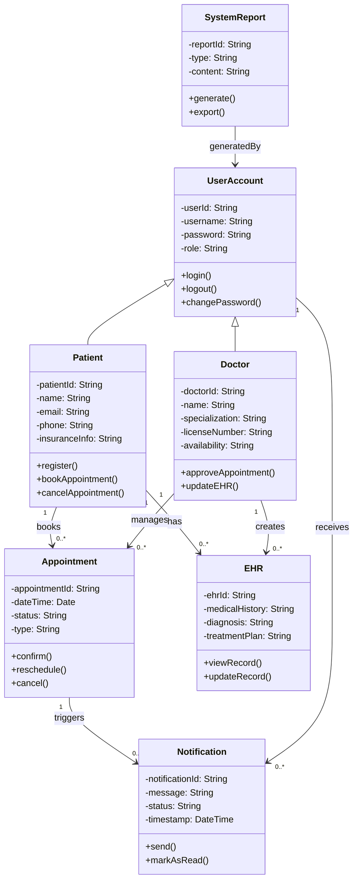

### Class Diagram
---

&nbsp;

### Key Design Decisions
---

#### Inheritance
- **Patient** and **Doctor** inherit from `UserAccount`, as both share common authentication features such as:
  - `login()`
  - `logout()`
  - `changePassword()`
- However, they also have distinct domain-specific behaviors:
  - `bookAppointment()` for **Patients**
  - `approveAppointment()` for **Doctors**

#### Association Multiplicity
- A **Patient** can book **multiple Appointments**.
- Each **Appointment** must be associated with **one Patient** and **one Doctor**.
- Each **Doctor** can create or update many **EHR (Electronic Health Record)** entries.
- Each **EHR** is associated with exactly **one Patient**.
- **Notifications** are tied to user actions (e.g., appointment changes) and are sent to relevant `UserAccount` instances (either Patients or Doctors).

#### Encapsulation
- All **attributes are private** (`-`) to enforce data encapsulation.
- Only **public methods** are exposed to allow controlled interaction with objects.

#### Modularity and Responsibility
- Each class is designed with a **single responsibility** to maintain modularity.
- For example, the `SystemReport` class is intended only for **Admins** and is **not linked** to `Appointment`, maintaining a **clear separation of concerns**.
