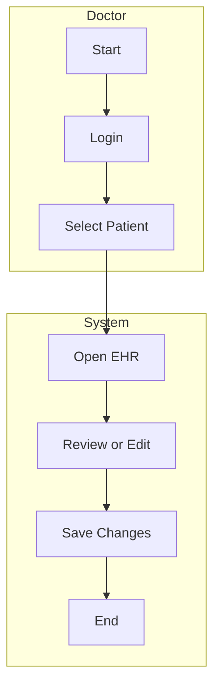

#### 5. EHR Review

```mermaid
flowchart TD
    subgraph Doctor
    A[Start] --> B[Login]
    B --> C[Select Patient]
    end
    subgraph System
    C --> D[Open EHR]
    D --> E[Review or Edit]
    E --> F[Save Changes]
    F --> G[End]
    end
```
