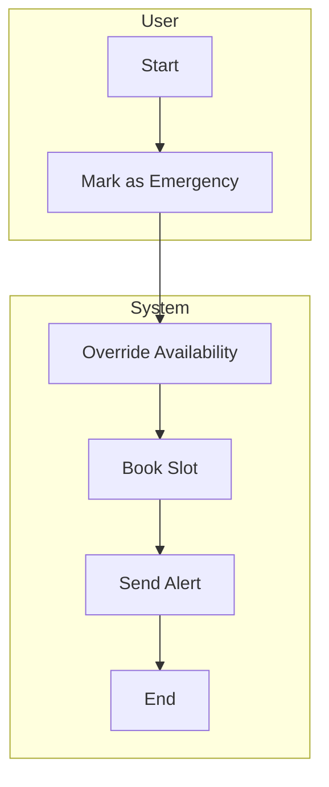

#### 8. Emergency Booking

```mermaid
flowchart TD
    subgraph User
    A[Start] --> B[Mark as Emergency]
    end
    subgraph System
    B --> C[Override Availability]
    C --> D[Book Slot]
    D --> E[Send Alert]
    E --> F[End]
    end
```
