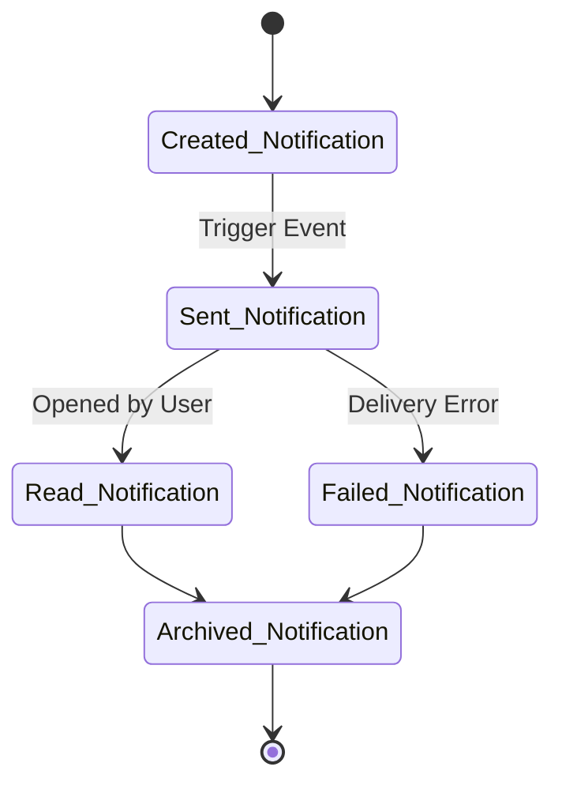

#### 4. Notification - State Transition Diagram

```mermaid
stateDiagram
    %% Initial state
    [*] --> Created_Notification
    Created_Notification --> Sent_Notification : Trigger Event
    Sent_Notification --> Read_Notification : Opened by User
    Sent_Notification --> Failed_Notification : Delivery Error
    Read_Notification --> Archived_Notification
    Failed_Notification --> Archived_Notification
    Archived_Notification --> [*]
```
