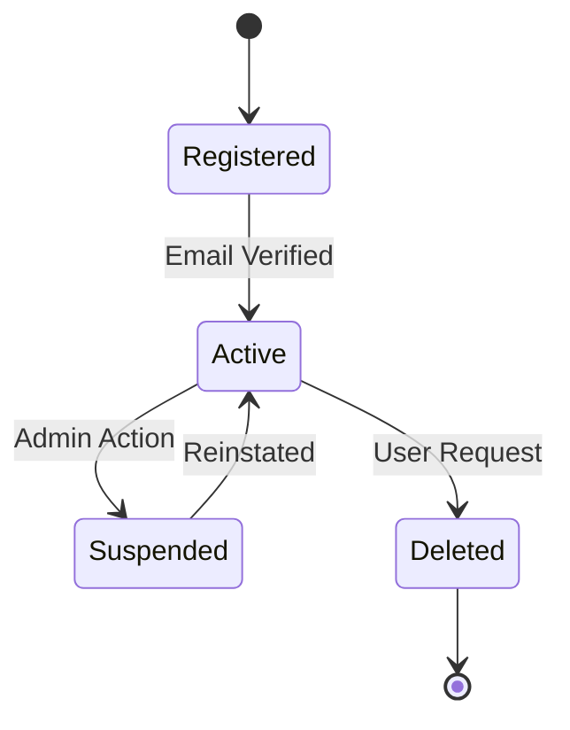
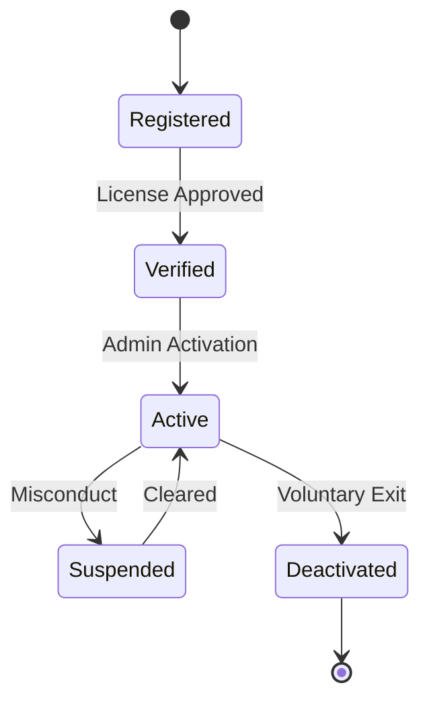
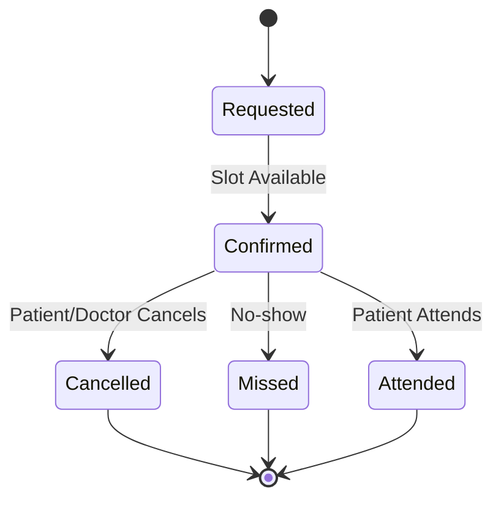
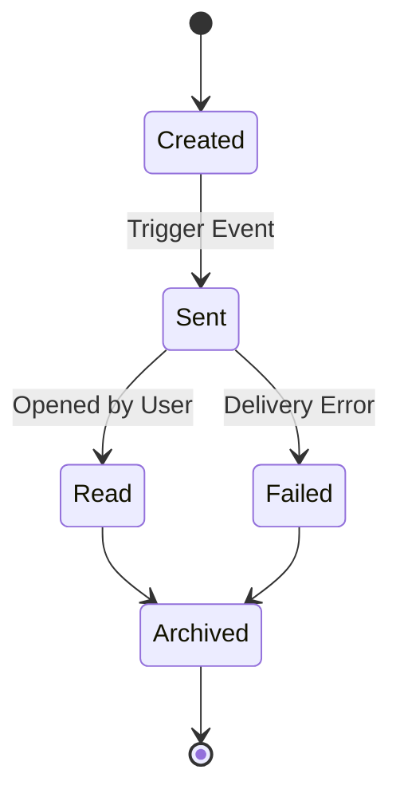
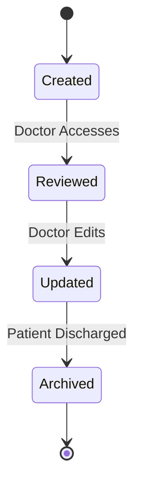
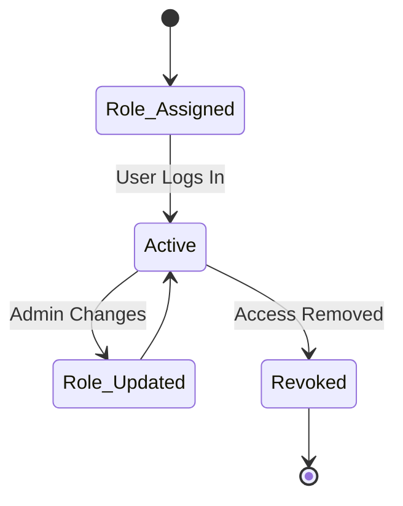
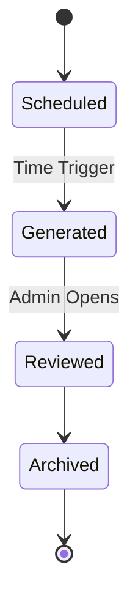
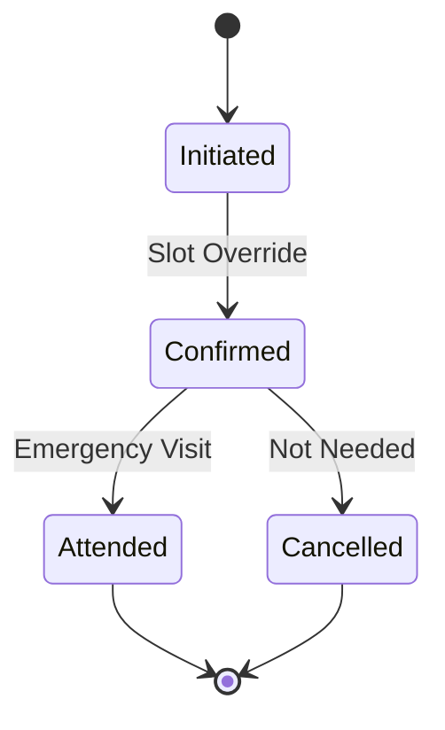

### State Transitions Diagrams

#### 1. Patient Account - State Transition Diagram

#### 2. Doctor Account - State Transition Diagram

#### 3. Appointment - State Transition Diagram

####  4. Notification - State Transition Diagram

#### 5. EHR - State Transition Diagram

#### 6. User Role & Permissions - State Transition Diagram

#### 7. System Report - State Transition Diagram

#### 8. Emergency Booking - State Transition Diagram

