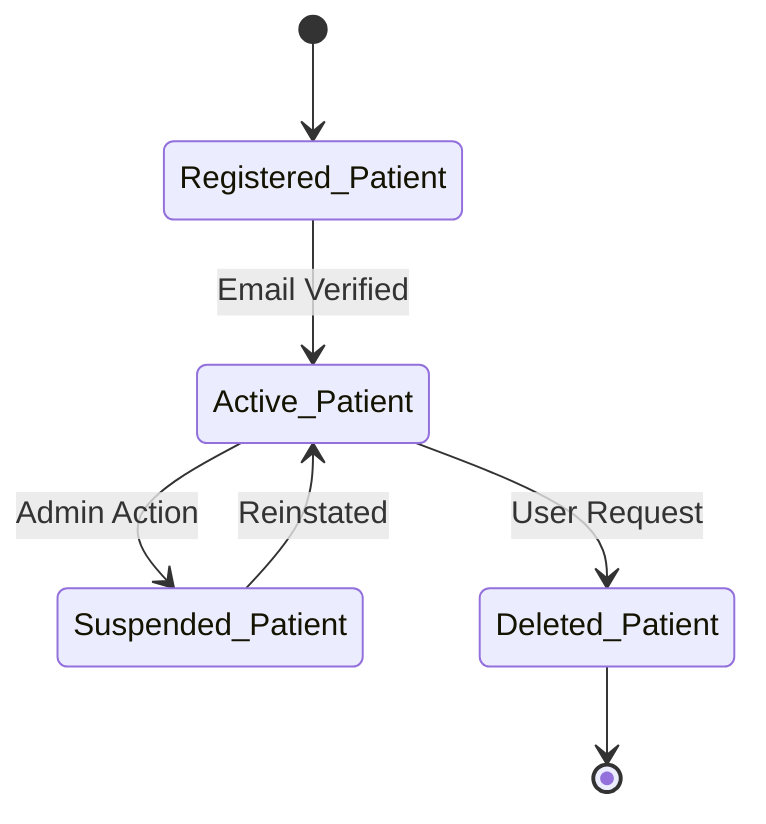
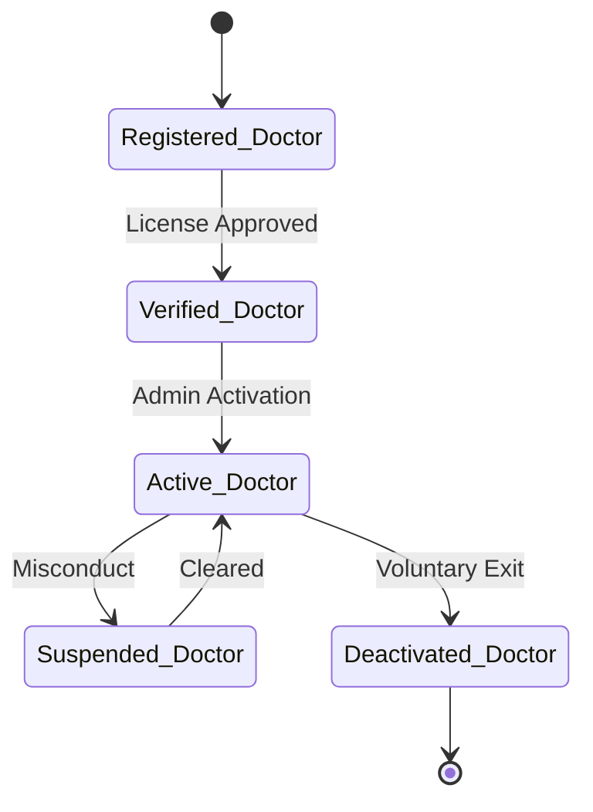
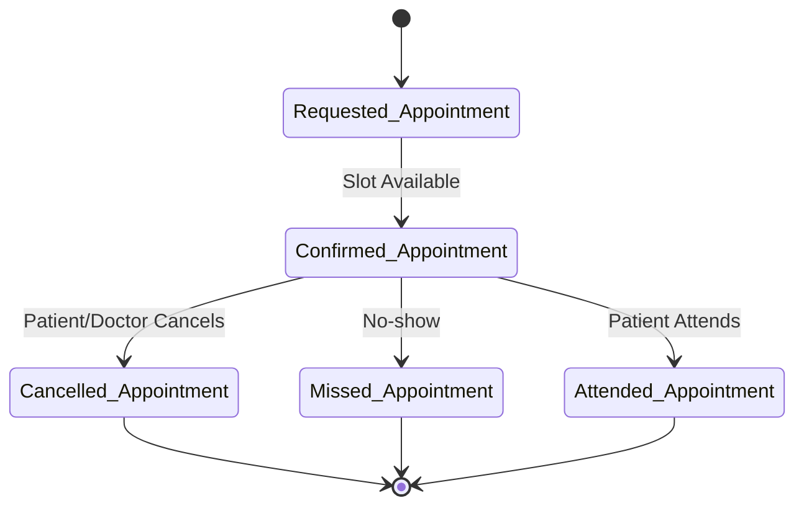
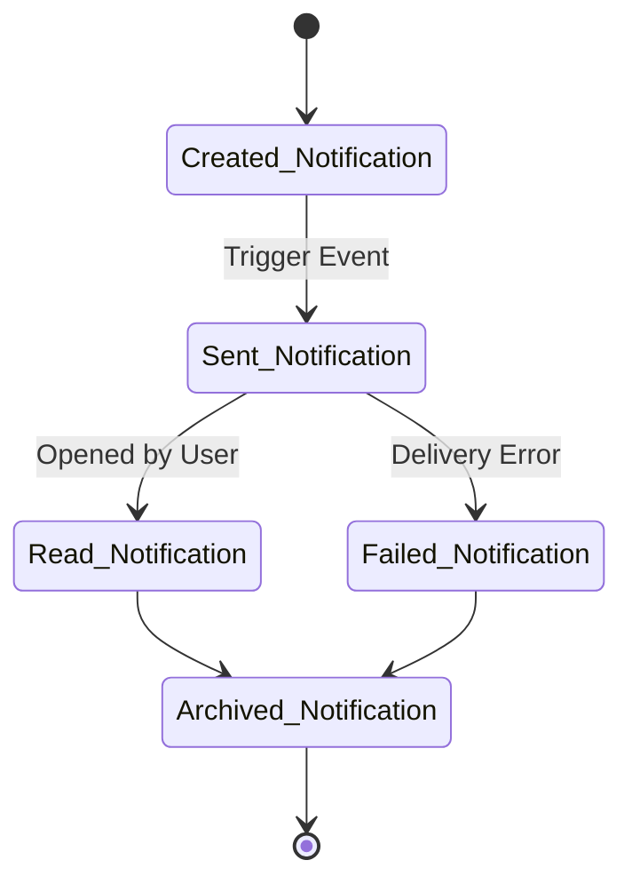
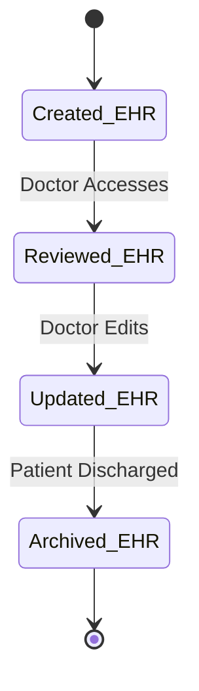
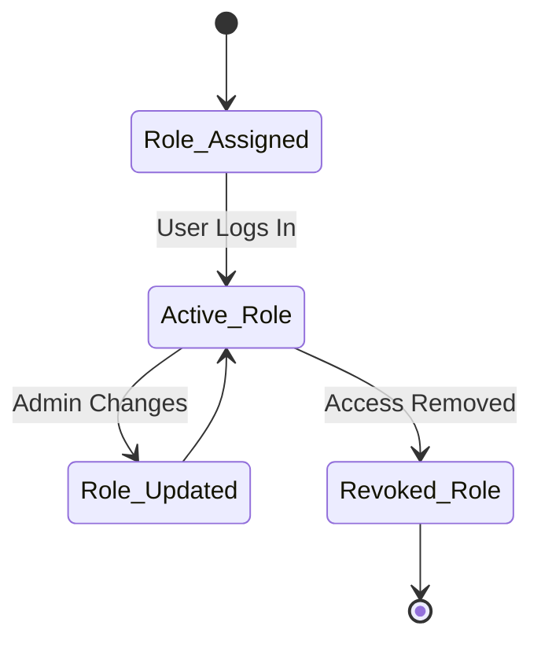
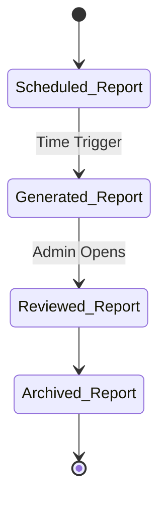
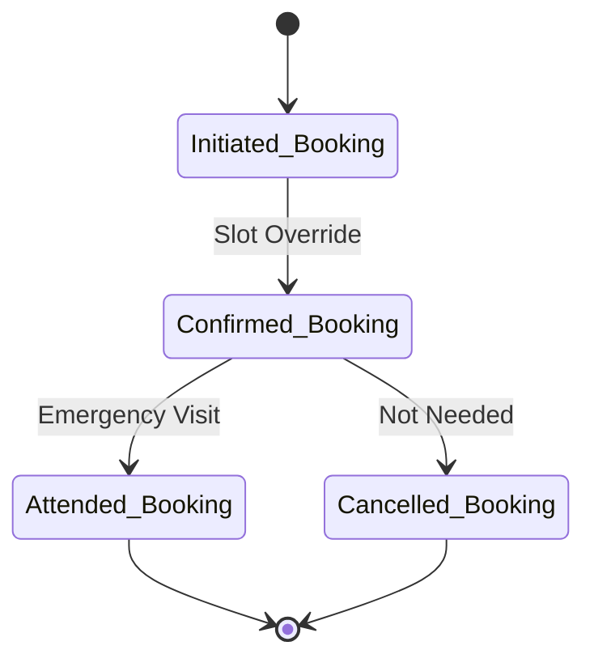

### State Transitions Diagrams

%% 2. Doctor Account - State Transition Diagram

%% 3. Appointment - State Transition Diagram

%% 4. Notification - State Transition Diagram

%% 5. Electronic Health Record (EHR) State Transition Diagram

%% 6. User Role & Permissions - State Transition Diagram

%% 7. System Report - State Transition Diagram

%% 8. Emergency Booking - State Transition Diagram

