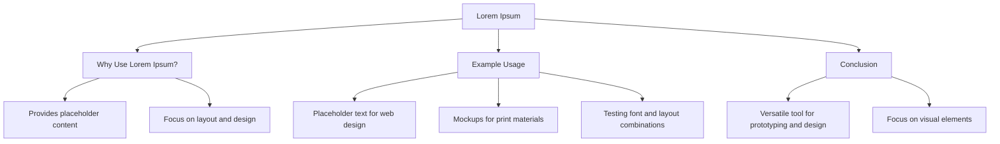

```mermaid
graph TD
    A[Lorem Ipsum] --> B[Why Use Lorem Ipsum?]
    B --> C[Provides placeholder content]
    B --> D[Focus on layout and design]
    A --> E[Example Usage]
    E --> F[Placeholder text for web design]
    E --> G[Mockups for print materials]
    E --> H[Testing font and layout combinations]
    A --> I[Conclusion]
    I --> J[Versatile tool for prototyping and design]
    I --> K[Focus on visual elements]
```
