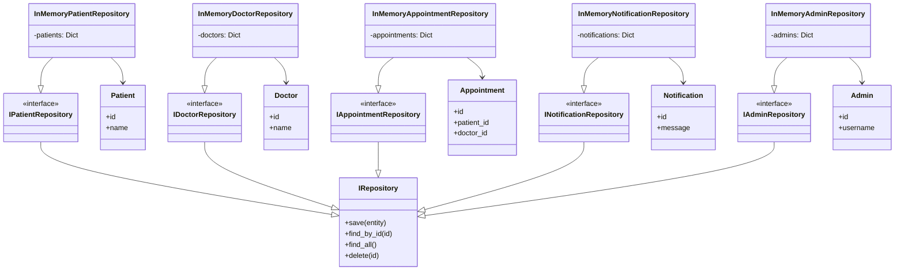

```mermaid
classDiagram

class IRepository {
  +save(entity)
  +find_by_id(id)
  +find_all()
  +delete(id)
}

class IPatientRepository {
  <<interface>>
}
IPatientRepository --|> IRepository

class IDoctorRepository {
  <<interface>>
}
IDoctorRepository --|> IRepository

class IAppointmentRepository {
  <<interface>>
}
IAppointmentRepository --|> IRepository

class INotificationRepository {
  <<interface>>
}
INotificationRepository --|> IRepository

class IAdminRepository {
  <<interface>>
}
IAdminRepository --|> IRepository


%% === In-Memory Implementations ===
class InMemoryPatientRepository {
  -patients: Dict
}
InMemoryPatientRepository --|> IPatientRepository

class InMemoryDoctorRepository {
  -doctors: Dict
}
InMemoryDoctorRepository --|> IDoctorRepository

class InMemoryAppointmentRepository {
  -appointments: Dict
}
InMemoryAppointmentRepository --|> IAppointmentRepository

class InMemoryNotificationRepository {
  -notifications: Dict
}
InMemoryNotificationRepository --|> INotificationRepository

class InMemoryAdminRepository {
  -admins: Dict
}
InMemoryAdminRepository --|> IAdminRepository


%% === Entities ===
class Patient {
  +id
  +name
}
class Doctor {
  +id
  +name
}
class Appointment {
  +id
  +patient_id
  +doctor_id
}
class Notification {
  +id
  +message
}
class Admin {
  +id
  +username
}

InMemoryPatientRepository --> Patient
InMemoryDoctorRepository --> Doctor
InMemoryAppointmentRepository --> Appointment
InMemoryNotificationRepository --> Notification
InMemoryAdminRepository --> Admin
```